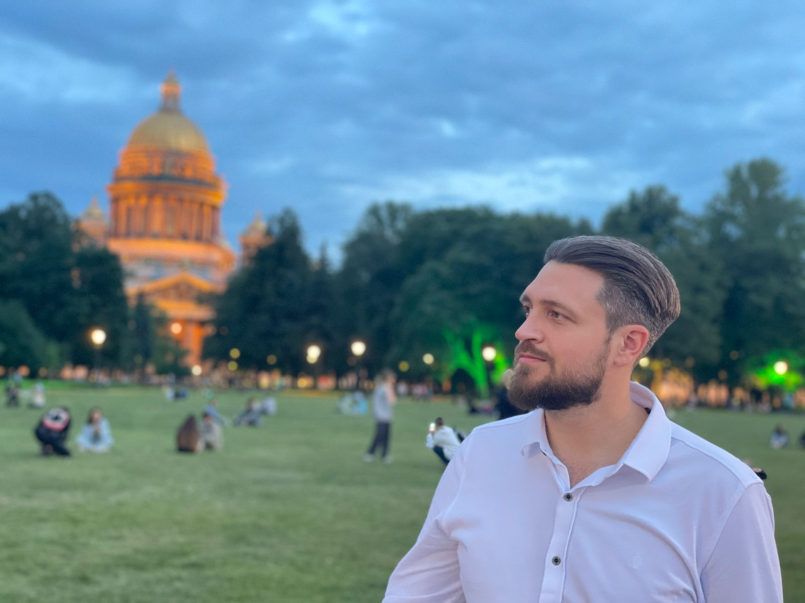

# Привет!

### Если мы с тобой знакомы, то просто “Привет!”, ну а если ты видишь меня впервые, то “Здравствуй”, позволь представиться, а также рассказать, что тебя ждет. 

Меня зовут Сергей, мне 31 год, я живу и работаю в Уфе. Работу мою описать достаточно сложно. Если складывать все, что я делаю, то получается такой список - инженер по наладке и испытаниям, инженер по автоматизации, инженер - программист, дизайнер, оператор - монтажер, специалист по контекстной рекламе. Набор, как вы можете видеть, достаточно специфический, и, скорее всего, даже не полный. Но все это многообразие моей деятельности можно охарактеризовать одним словом - мультипотенциал. 

У меня есть мечта… точнее мечты (всего 2 вообще-то) -  Стать разработчиком игр и съездить на Кубу (а может и уехать туда жить). Последняя мечта на текущий момент мне не особо доступна, но в ее реализации вполне может помочь и первая.

Как уже писал ранее - иногда я занимаюсь программированием. Основная моя рабочая деятельность связана с командировками и работой в качестве инженера по наладке, испытаниям и автоматизации на объектах. Когда же командировок нет - я работаю в офисе и занимаюсь разработкой прошивок для микроконтроллеров, ПЛК (программируемых логических контроллеров), а также разработкой программного обеспечения верхнего уровня. Не особо похоже на разработку игр, не правда ли? Но я надеюсь уже в ближайшее время это изменить. 

И вот здесь начинается самая главная часть поста. Я предлагаю вам отправится вместе со мной в длинное путешествие от инженера до разработчика игр. Впереди нас ждет много интересного и увлекательного. Я буду документировать каждый шаг, который приближает меня к цели создать увлекательную и интересную игру. 

Но не только это вас здесь ждет! Конечно, я не смогу оставить без внимания основную работу и другую деятельность, ведь я мультипотенциал, поэтому параллельно буду радовать вас следующим контентом:
- Историями, фотографиями и видео из мест и городов - где я бываю;

- Всем тем, что меня вдохновляет (книги, фильмы, музыка, блоги, посты, люди);

- Рассказами о собственных проектах, которые веду параллельно на пути к мечте

### Уже в ближайшее время я расскажу вам о своем плане по превращению из инженера в разработчика игр и объясню - почему выбрал именно такой путь. 